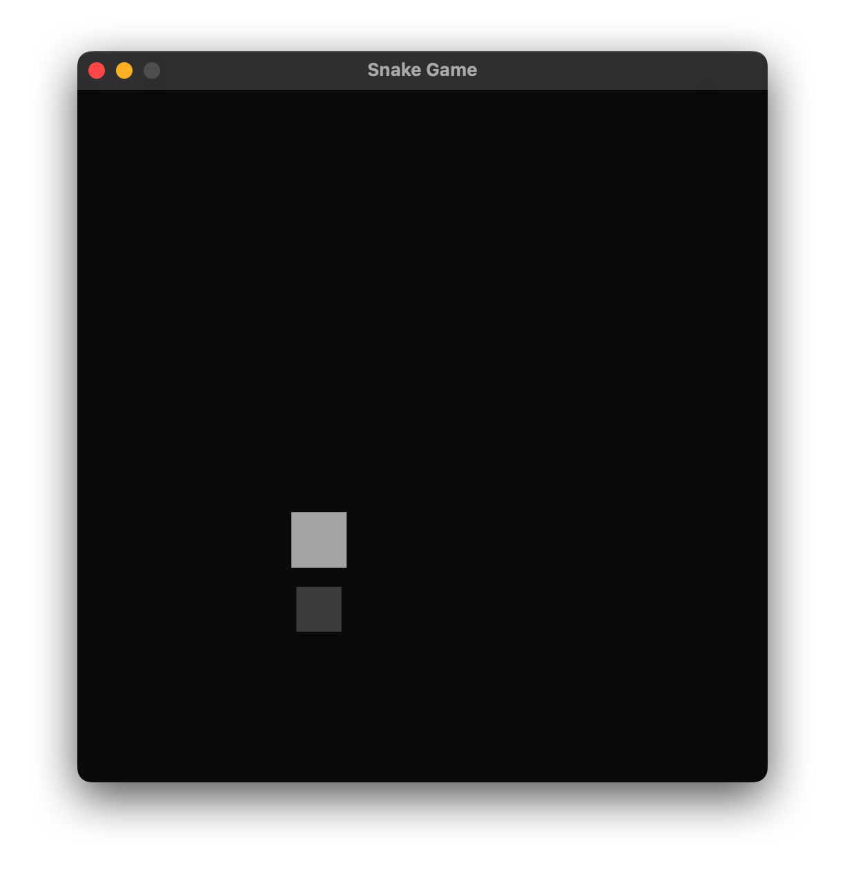

# Snake game

Juego de la serpiente ejemplo sacado de la web

[Tutorial Bevy snake](https://mbuffett.com/posts/bevy-snake-tutorial/)

Tener en cosideración que gran parte del tutorial fue actualizado ya que la version de la libreria con la que fue desarrollado, es anterior a las 0.13.

## Stack

rustc 1.91.1 
cargo 1.91.1 

## Dependencias

bevy "0.13"
rand "0.8"

Las dependencias se deben agregar en archivo Cargo.toml luego de la directiva dependencies.

### Ejemplo

```toml
[dependencies]
bevy = "0.13"
rand = "0.8"
```

## Ejecutar el juego.

Para ejectutar el juego usaremos el comando

```bash
cargo run
```

Este comando instalara las dependencias y ejecutara el script

